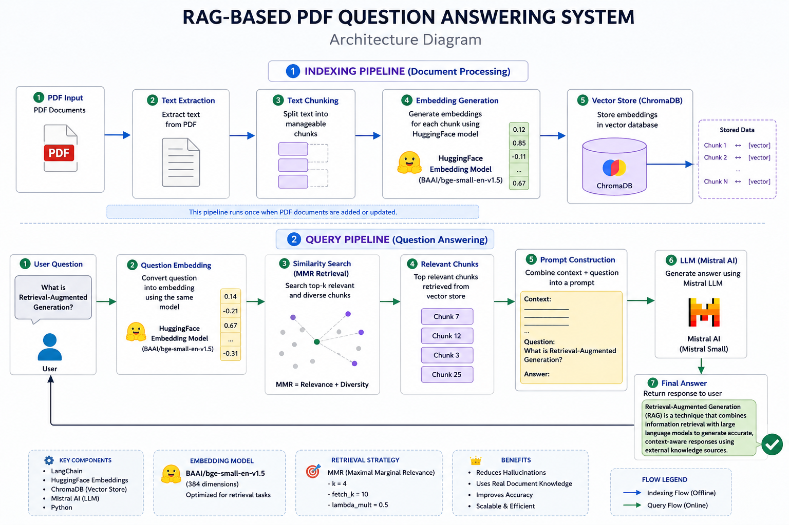

# 📄 AI-Powered RAG PDF Question Answering System

## 🚀 Overview

This project is a **Retrieval-Augmented Generation (RAG) based Question Answering System** that allows users to upload PDF documents and ask natural language questions. The system retrieves relevant context from the document and uses a Large Language Model (Mistral AI) to generate accurate, grounded responses.

Instead of directly asking the LLM (which may hallucinate), this system first retrieves relevant document chunks, ensuring **factual, context-based answers**.

---

## 🧠 What is RAG?

**Retrieval-Augmented Generation (RAG)** is a hybrid AI approach that combines:

* 🔎 **Information Retrieval** (searching relevant document content)
* 🤖 **Large Language Models** (generating human-like responses)

### 👉 Why RAG?

* Reduces hallucination
* Uses real document knowledge
* Improves factual accuracy
* Scales to large datasets (PDFs, docs, etc.)

---

## ⚙️ System Architecture (End-to-End Flow)

```
PDF Document
    ↓
Text Extraction
    ↓
Chunking (Text Splitting)
    ↓
Embedding Generation (HuggingFace BGE Model)
    ↓
Vector Storage (ChromaDB)
    ↓
User Question Input
    ↓
Question Embedding
    ↓
Similarity Search (MMR Retrieval)
    ↓
Relevant Context Retrieval
    ↓
Prompt Construction
    ↓
Mistral LLM (Response Generation)
    ↓
Final Answer
```


---


## 📂 Step-by-Step Pipeline Explanation

---

### 📄 1. PDF Loading & Text Extraction

The system first loads PDF files and extracts raw text using document loaders.

* Converts PDF → text format
* Removes structural noise
* Prepares content for processing

---

### ✂️ 2. Text Chunking (Important Step)

Since LLMs cannot process large documents at once, text is split into **smaller overlapping chunks**.

#### Why chunking?

* Maintains context continuity
* Improves retrieval accuracy
* Helps embedding models perform better

Example:

```
Chunk 1: Paragraph 1-2
Chunk 2: Paragraph 2-3 (overlap)
Chunk 3: Paragraph 3-4
```

---

### 🧠 3. Embedding Generation (Hugging Face Model)

Each text chunk is converted into a **high-dimensional vector representation**.

```python
from langchain_community.embeddings import HuggingFaceEmbeddings

embedding = HuggingFaceEmbeddings(
    model_name="BAAI/bge-small-en-v1.5"
)
```

#### What embeddings do?

* Convert text → numeric vectors
* Capture semantic meaning
* Enable similarity search

---

### 🗃️ 4. Vector Database (ChromaDB)

All embeddings are stored in **ChromaDB**, a persistent vector database.

#### Why vector DB?

* Fast similarity search
* Scalable storage
* Efficient retrieval of relevant chunks

Each chunk is stored as:

```
{ text_chunk → embedding_vector }
```

---

### 🔍 5. Question Processing (Query Embedding)

When user asks a question:

```
User Question → Embedding Model → Question Vector
```

Now the question is also converted into the same vector space.

---

### 🔎 6. Similarity Search (MMR Retrieval)

The system retrieves the most relevant chunks using:

```python
search_type = "mmr"

search_kwargs = {
    "k": 4,
    "fetch_k": 10,
    "lambda_mult": 0.5
}
```

#### MMR (Maximal Marginal Relevance):

Balances:

* 🎯 Relevance (to query)
* 🔄 Diversity (avoid repetition)

---

### 📦 7. Context Construction

Retrieved chunks are combined into a **context window**:

```
Context = Top relevant document chunks
```

This context is then injected into the prompt.

---

### 🤖 8. LLM Response Generation (Mistral AI)

The final step uses **Mistral Small (via API)**.

The prompt looks like:

```
Context: <retrieved document chunks>

Question: <user query>

Answer:
```

#### Why Mistral?

* Fast inference
* High-quality reasoning
* Cost-efficient
* Strong open-weight LLM

---

### 💬 9. Final Answer Output

The model generates a:

* Context-aware answer
* Grounded in PDF content
* Reduced hallucination response

---

## 🧠 Tech Stack


---

## 📦 Installation

```bash
git clone https://github.com/Khushwant123-x/AI-PDF-Assistant-RAG-App-.git
cd AI-PDF-Assistant-RAG-App-
pip install -r requirements.txt
```

---

## 🔐 Environment Setup

Create `.env` file:

```env
MISTRAL_API_KEY=your_api_key_here
```

---

## ▶️ Run Project

```bash
python app.py
```

---

## 💡 Example Use Case

### Input:

```
What is Retrieval-Augmented Generation?
```

### Output:

```
Retrieval-Augmented Generation (RAG) is a technique that combines document retrieval with large language models to generate accurate, context-aware answers using external knowledge sources.
```

---

## 🎯 Key Features

* 📄 PDF-based knowledge ingestion
* 🧠 Semantic search using embeddings
* 🔎 MMR-based retrieval system
* 🗃️ Vector database storage (ChromaDB)
* 🤖 Mistral LLM integration
* ⚡ Reduced hallucinations
* 💬 CLI-based chat interface

---

## 🚀 Future Improvements

* 🌐 Streamlit web UI
* ⚡ FastAPI backend
* 📚 Multi-PDF upload support
* 🔗 Source citation (page-level grounding)
* 💾 Chat memory (conversational RAG)
* ☁️ Cloud deployment (AWS/GCP/Azure)
* 🔎 Hybrid search (BM25 + semantic)

---

## 📈 Skills Demonstrated

* Retrieval-Augmented Generation (RAG)
* Vector Databases (ChromaDB)
* Embedding Models (HuggingFace BGE)
* Prompt Engineering
* LLM Integration (Mistral AI)
* LangChain Framework
* Information Retrieval Systems
* NLP Pipeline Design

---

## 👨‍💻 Author

**Khushwant Singh Rajat**

Aspiring AI Engineer focused on Generative AI, LLM applications, and Retrieval-Augmented Generation systems.

---

## ⭐ Final Note

This project demonstrates how Large Language Models can be enhanced with external knowledge sources using **RAG architecture**, significantly improving accuracy, reliability, and real-world usability.


